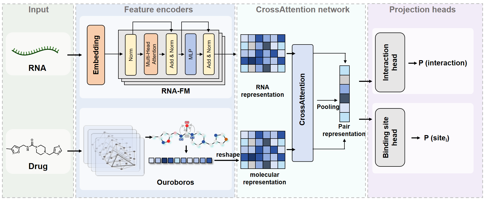

# CoCoBind: Consistency-Contrastive Multitask Learning for RNA-Ligand Interaction and Binding Site Prediction

<p align="center">
  
</p>

CoCoBind is a deep learning framework for simultaneously predicting **RNA-small molecule interactions** and **binding sites** on RNA. The model leverages:

- **RNA-FM** and **Ouroboros** for RNA and molecular representations
- **Cross-attention mechanism** for fusing molecular and RNA features
- **Consistency constraint** linking interaction and site predictions
- **Contrastive learning** improving modeling preferences
- **Multi-task learning** for joint optimization

## 🚀 Quick Start

### Installation

```bash
# Clone the repository
git clone https://github.com/Shihang-Wang-58/CoCoBind.git
cd CoCoBind

# Create conda environment
conda create -n cocobind python=3.9
conda activate cocobind

# Install PyTorch (adjust for your CUDA version)
pip install torch==2.2.1 torchvision==0.17.1 torchaudio==2.2.1 --index-url https://download.pytorch.org/whl/cu121

# Install dependencies
pip install -r requirements.txt
```

### Training

```bash
# Single run
python -m cocobind.train \
    --split unseen_pair \
    --fold 0 \
    --epochs 100 \
    --batch_size 64 \
    --lr 1e-4 \
    --use_cross_attn true \
    --lambda_cons 0.5

# Train all splits and folds
bash scripts/train.sh
# or on Windows:
.\scripts\train.ps1
```

### Evaluation

```bash
python -m cocobind.eval \
    --checkpoint models/ECFP4/best_model.pt \
    --split unseen_pair \
    --fold 0 \
    --save_preds
```

## 📁 Project Structure

```
CoCoBind/
├── cocobind/                # Main package
│   ├── __init__.py
│   ├── __main__.py          # CLI entry point
│   ├── config.yaml          # Default configuration
│   ├── data.py              # Data loading utilities
│   ├── eval.py              # Evaluation script
│   ├── featurizers.py       # RNA-FM and molecular featurizers
│   ├── losses.py            # Loss functions (MultiTaskLoss)
│   ├── metrics.py           # Evaluation metrics
│   ├── model.py             # Model architecture
│   ├── train.py             # Training script
│   ├── training_utils.py    # Schedulers, EMA, optimizers
│   └── utils.py             # General utilities
├── scripts/
│   ├── train.sh             # Batch training (Linux/Mac)
│   ├── train.ps1            # Batch training (Windows)
│   └── eval.sh              # Batch evaluation
├── data/                    # Data directory
├── outputs/                 # Training outputs
├── requirements.txt
└── README.md
```

## 📊 Data Preparation

### Dataset Structure

Organize your data as follows:

```
data/
├── unseen_pair/
│   ├── dti_data/
│   │   ├── train_fold0/
│   │   │   └── raw/interactions.csv
│   │   ├── val_fold0/
│   │   │   └── raw/interactions.csv
│   │   └── test_fold/
│   │       └── raw/interactions.csv
│   └── bs_data/
│       └── ... (same structure)
├── unseen_rna/
├── unseen_compound/
└── unseen_both/
```

### Data Format

Both DTI and binding site data use the same CSV format (`interactions.csv`):

```csv
,sequence,smiles,source,interactions,rna_type,oligomer_type,binding_site_index,rna_cluster,compound_cluster
0,GGACGCUUUCGAGCCGUCC,CCN1CCN(c2cc3c(...)CC1,PDB,1.0,other,monomer,"[0.0, 1.0, 1.0, 1.0, ...]",253,266
```

**Key columns:**

- `sequence`: RNA sequence (A/U/G/C)
- `smiles`: Small molecule SMILES string
- `interactions`: Binary label (1.0 for positive, 0.0 for negative)
- `binding_site_index`: Python list of 0/1 values indicating binding sites for each nucleotide position, e.g., `"[0.0, 1.0, 1.0, 0.0, ...]"`. Length equals sequence length. Only available for positive samples.

## ⚙️ Configuration

Key configuration options in `config.yaml`:

```yaml
# Model architecture
model:
  d_model: 256          # Hidden dimension
  n_mol_tokens: 8       # Number of virtual tokens for molecule
  n_heads: 8            # Attention heads
  use_cross_attn: true  # Enable cross-attention

# Loss weights
loss:
  lambda_site: 1.0      # Binding site loss weight
  lambda_cons: 0.5      # Consistency constraint weight
  cons_aggregation: "noisy_or"  # noisy_or, max, mean

# Training
train:
  epochs: 200
  batch_size: 32
  lr: 5.0e-4
  patience: 30          # Early stopping patience
```

## 🔬 Ablation Studies

### Without Consistency Constraint

```bash
python -m cocobind.train --split unseen_pair --fold 0 --lambda_cons 0
```

### Without Cross-Attention

```bash
python -m cocobind.train --split unseen_pair --fold 0 --use_cross_attn false
```

### Different Molecular Encoders

```bash
# ECFP4 (default, 2048-dim)
python -m cocobind.train --split unseen_pair --fold 0 --mol_encoder ecfp4

# Ouroboros (2048-dim, requires precomputed features)
python -m cocobind.train --split unseen_pair --fold 0 \
    --mol_encoder ouroboros \
    --mol_features_path cache/mol_features/ouroboros_features.pkl
```

### Precomputing Ouroboros Features

Use the optional dependency set when you need to create Ouroboros molecular features in the same environment as CoCoBind:

```bash
pip install -r requirements.txt
pip install -r requirements-ouroboros.txt
```

Then precompute a named feature file. `--output` can be either a directory or a concrete `.pkl` path, so you do not need to reuse `cache/mol_features` for every run:

```bash
python -m cocobind.precompute_mol_features \
    --model ouroboros \
    --model_path ./Ouroboros/models/Ouroboros_M1c \
    --data_root ./data \
    --output cache/ouroboros/unseen_pair_all_ouroboros.pkl \
    --batch_size 256 \
    --device cuda
```

For small ad-hoc prediction jobs, you can skip the `.pkl` file and let CoCoBind call Ouroboros directly. Features are cached under `cache/mol_features/<model-id>/` by the backend, but precomputing is still recommended for training and large screening libraries:

```bash
python -m cocobind.predict \
    --checkpoint models/Ouroboros/best.pt \
    --config models/Ouroboros/config_resolved.yaml \
    --mol_encoder ouroboros \
    --mol_model_path ./Ouroboros/models/Ouroboros_M1c \
    --sequence "GGCUAGCUAUAGCUAGC" \
    --smiles "CC1=NC2=CC=CC=C2N1"
```

For inference, pass the same molecular encoder family used by the checkpoint:

```bash
python -m cocobind.predict \
    --checkpoint models/Ouroboros/best.pt \
    --config models/Ouroboros/config_resolved.yaml \
    --mol_encoder ouroboros \
    --mol_features_path cache/ouroboros/unseen_pair_all_ouroboros.pkl \
    --sequence "GGCUAGCUAUAGCUAGC" \
    --smiles "CC1=NC2=CC=CC=C2N1"
```

Important: do not switch an ECFP4-trained checkpoint to Ouroboros features at inference time. Train or load a checkpoint that was trained with `--mol_encoder ouroboros` and the matching precomputed feature file.

### Command-Line Virtual Screening

You can screen a local compound library without starting the web backend. For the bundled MCE library and the RNA sequence below, the ECFP4 model can run directly:

```bash
python -m cocobind screen \
  --model_id ECFP4 \
  --sequence UGGGACACCCCUCCCCAACGAGGGGCGAAUAUCUGGAAGGAUA \
  --library data/compound_library/MCE.csv \
  --top_k 20 \
  --max_candidates 48504 \
  --output outputs/screening/MCE_ECFP4_UGGGAC.csv \
  --device cuda
```

For the Ouroboros model, precompute library features once so repeated screening runs do not re-encode the same molecules:

```bash
python -m cocobind.precompute_mol_features \
  --model ouroboros \
  --model_path ./Ouroboros/models/Ouroboros_M1c \
  --csv_files data/compound_library/MCE.csv \
  --output cache/mol_features/MCE_ouroboros.pkl \
  --batch_size 256 \
  --device cuda
```

Then screen with the Ouroboros checkpoint:

```bash
python -m cocobind screen \
  --model_id Ouroboros \
  --sequence UGGGACACCCCUCCCCAACGAGGGGCGAAUAUCUGGAAGGAUA \
  --library data/compound_library/MCE.csv \
  --mol_features_path cache/mol_features/MCE_ouroboros.pkl \
  --mol_model_path ./Ouroboros/models/Ouroboros_M1c \
  --top_k 20 \
  --max_candidates 48504 \
  --output outputs/screening/MCE_Ouroboros_UGGGAC.csv \
  --device cuda
```

`--max_candidates` is optional; remove it to score the full CSV. The script prints the top candidates to the terminal and writes the full ranked table when `--output` is set.

### Web Model Selection and Screening

The FastAPI backend auto-discovers model folders under `models/` and compound libraries under `data/compound_library/`. The React Run page can switch between model versions and run library screening through:

- `GET /models`
- `GET /libraries`
- `POST /predict`
- `POST /predict_batch`
- `POST /screen`

Example: screen the MCE compound library against one RNA sequence:

```bash
# Start the backend first in another shell:
uvicorn deploy.backend.main:app --host 0.0.0.0 --port 8000

# ECFP4 model: no molecular-feature precompute is needed.
curl -X POST http://localhost:8000/screen \
  -H "Content-Type: application/json" \
  -d '{
    "rna_sequence": "UGGGACACCCCUCCCCAACGAGGGGCGAAUAUCUGGAAGGAUA",
    "model_id": "ECFP4",
    "library_id": "MCE",
    "top_k": 20,
    "max_candidates": 48504
  }'
```

For the Ouroboros model, precomputing the MCE library is recommended before web screening:

```bash
python -m cocobind.precompute_mol_features \
  --model ouroboros \
  --model_path ./Ouroboros/models/Ouroboros_M1c \
  --csv_files data/compound_library/MCE.csv \
  --output cache/mol_features/MCE_ouroboros.pkl \
  --batch_size 256 \
  --device cuda

export COCOBIND_OUROBOROS_MOL_FEATURES_PATH=cache/mol_features/MCE_ouroboros.pkl
uvicorn deploy.backend.main:app --host 0.0.0.0 --port 8000

curl -X POST http://localhost:8000/screen \
  -H "Content-Type: application/json" \
  -d '{
    "rna_sequence": "UGGGACACCCCUCCCCAACGAGGGGCGAAUAUCUGGAAGGAUA",
    "model_id": "Ouroboros",
    "library_id": "MCE",
    "top_k": 20,
    "max_candidates": 48504
  }'
```

If `COCOBIND_OUROBOROS_MOL_FEATURES_PATH` is not set, the backend will try the feature path in `models/Ouroboros/config_resolved.yaml`. If a molecule is missing and `./Ouroboros/models/Ouroboros_M1c` is available, it can compute the missing Ouroboros feature on demand, but that is much slower for large libraries.

## 📄 License

This project is licensed under the MIT License - see the [LICENSE](LICENSE) file for details.

## 💌 Get in Touch

We welcome community contributions of extension tools based on the CoCoBind model, etc. If you have any questions, please feel free to contact Shihang Wang (Email: p2521371@mpu.edu.mo).

## 🙏 Acknowledgments

- [RNA-FM](https://github.com/ml4bio/RNA-FM) for pre-trained RNA representations
- [Ouroboros](https://github.com/Wang-Lin-boop/Ouroboros) for pre-trained molecular representations
- [DeepRNA-DTI](https://github.com/GIST-CSBL/DeepRNA-DTI) for the datasets used in this study

Thank you all for your attention to this work.


